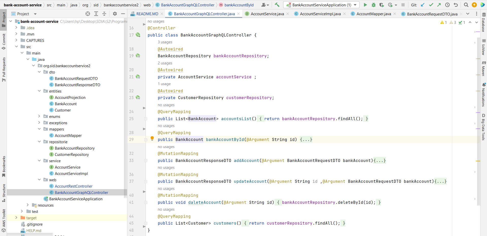

<h3>I. Micro Service avec REST</h3>
<h4>1. Créer un projet Spring Boot avec les dépendances Web, Spring Data JPA, H2, Lombok</h4>

<h4>2. Créer l'entité JPA Compte</h4>

<h4>3. Créer l'interface CompteRepository basée sur Spring Data</h4>

<h4>4. Tester la couche DAO</h4>

<h4>5. Créer le Web service Restfull qui permet de gérer des comptes</h4>

<h4>6. Tester le web micro-service en utilisant un client REST comme Postman</h4>

<h4>7. Générer et tester le documentation Swagger de des API Rest du Web service</h4>

<h4>9. Créer les DTOs et Mappers</h4>
*DTOs :

*Mapper :

<h4>10. Créer la couche Service (métier) et du micro service</h4>

<h4>11. Créer un Web service GraphQL pour ce micro-service :</h4>

*Le test avec GraphQL

